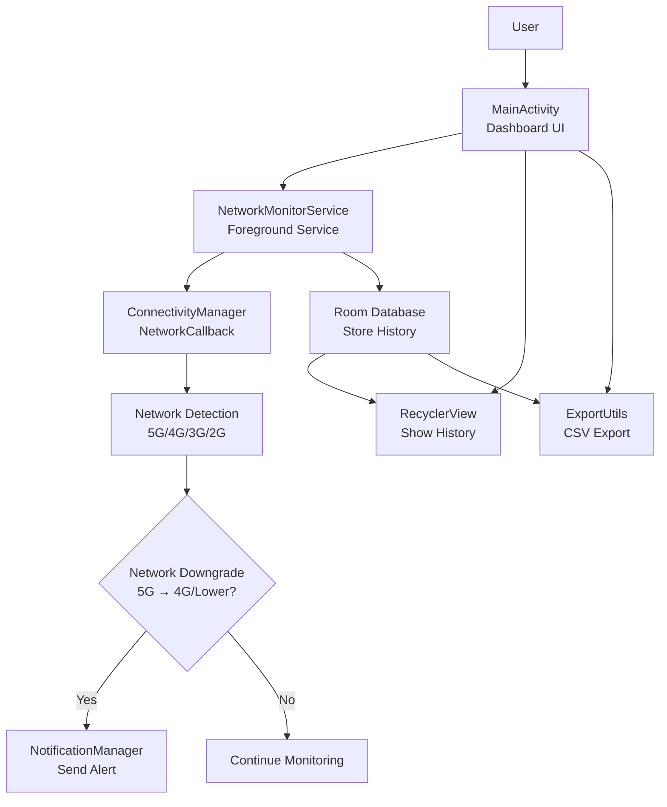

```mermaid
graph TB
    A[User] --> B[MainActivity<br/>Dashboard UI]
    B --> C[NetworkMonitorService<br/>Foreground Service]
    C --> D[ConnectivityManager<br/>NetworkCallback]
    D --> E[Network Detection<br/>5G/4G/3G/2G]
    E --> F{Network Downgrade<br/>5G → 4G/Lower?}
    F -->|Yes| G[NotificationManager<br/>Send Alert]
    F -->|No| H[Continue Monitoring]
    C --> I[Room Database<br/>Store History]
    B --> J[RecyclerView<br/>Show History]
    I --> J
    B --> K[ExportUtils<br/>CSV Export]
    I --> K
```