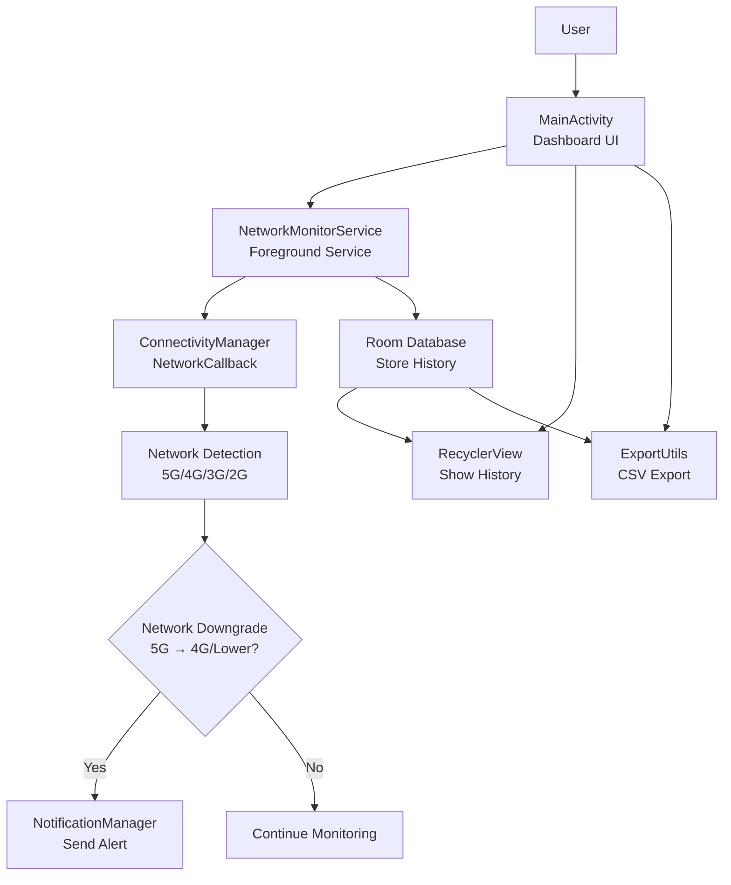

# NetAlert AI - 5G to 4G Network Downgrade Monitor

An Android application that monitors your mobile network connection in real-time and notifies you when your premium 5G connection downgrades to 4G or lower speeds.

## Features

- 📶 **Real-time Monitoring**: Continuously monitors device's current network type (5G, 4G, 3G, etc.)
- ⚠️ **Instant Alerts**: Sends notification when a downgrade occurs (5G → 4G)
- 📋 **History Logging**: Maintains local history log (timestamp + old network + new network)
- 📊 **Dashboard**: Clean dashboard showing current network status and downgrade statistics
- 📤 **Export**: Option to export logs (CSV)
- 🔋 **Efficient**: Runs efficiently in the background with minimal battery usage

## Technical Implementation

Uses modern Android APIs:

- `ConnectivityManager.NetworkCallback` for real-time network monitoring
- `NotificationManager` for notifications
- `Room Database` for local data storage
- `Foreground service` for continuous monitoring

## Screenshots


*Dashboard showing current network status and history*


*Notification when network downgrades from 5G to 4G*

## Project Structure

```
NetAlertAI/
├── app/
│   ├── src/
│   │   ├── main/
│   │   │   ├── java/com/netalert/ai/
│   │   │   │   ├── database/              # Room database components
│   │   │   │   ├── utils/                 # Utility classes
│   │   │   │   ├── MainActivity.java      # Main activity
│   │   │   │   ├── NetworkHistory.java    # Data model
│   │   │   │   ├── NetworkHistoryAdapter.java # RecyclerView adapter
│   │   │   │   ├── NetworkChangeReceiver.java # Network change receiver
│   │   │   │   └── NetworkMonitorService.java # Network monitoring service
│   │   │   ├── res/
│   │   │   │   ├── layout/                # Layout files
│   │   │   │   ├── values/                # Resource files
│   │   │   │   └── drawable/              # Drawable resources
│   │   │   └── AndroidManifest.xml        # Application manifest
│   │   └── build.gradle                   # App module build configuration
│   └── build.gradle                       # Project level build configuration
├── gradle/
│   └── wrapper/                           # Gradle wrapper files
├── build.gradle                           # Top-level build configuration
├── settings.gradle                        # Project settings
└── gradle.properties                      # Gradle properties
```

## Getting Started

### Prerequisites

- Android Studio Flamingo (2022.2.1) or later
- Android SDK API Level 33 (Android 13) or later
- Java Development Kit (JDK) 11 or later

### Installation

1. Clone the repository:
   ```bash
   git clone https://github.com/Mohansaina/5G-to-4G-alert.git
   ```

2. Open in Android Studio:
   - Launch Android Studio
   - Select "Open an existing Android Studio project"
   - Navigate to the NetAlertAI directory

3. Build the project:
   - Wait for Gradle to sync
   - Select "Build" > "Make Project"

4. Run the application:
   - Connect an Android device or start an emulator
   - Select "Run" > "Run 'app'"

## Architecture



## Permissions

- `ACCESS_NETWORK_STATE` - To monitor network state changes
- `POST_NOTIFICATIONS` - To send notifications (Android 13+)
- `FOREGROUND_SERVICE` - To run the monitoring service
- `FOREGROUND_SERVICE_SPECIAL_USE` - Special use foreground service

## Documentation

- [BUILD_AND_RUN.md](BUILD_AND_RUN.md) - Detailed build and run instructions
- [IMPLEMENTATION_GUIDE.md](IMPLEMENTATION_GUIDE.md) - Complete implementation guide
- [DEVELOPMENT_SETUP.md](DEVELOPMENT_SETUP.md) - Development environment setup
- [ARCHITECTURE.md](ARCHITECTURE.md) - Architecture diagram
- [ROADMAP.md](ROADMAP.md) - Feature roadmap
- [PROJECT_SUMMARY.md](PROJECT_SUMMARY.md) - Complete project summary

## Core Components

### NetworkMonitorService

A foreground service that continuously monitors network changes using `ConnectivityManager.NetworkCallback`.

### NetworkChangeReceiver

A broadcast receiver that listens for connectivity changes (alternative approach).

### NetworkHistory

A data class representing a network change event.

### NetworkHistoryAdapter

A RecyclerView adapter for displaying network change history.

### Room Database

Local storage for network history using Android Room persistence library.

## Future Enhancements

- Firebase integration for cloud logging
- More detailed statistics and analytics
- Enhanced UI with charts and graphs
- Machine learning for predictive network quality analysis
- Geolocation tracking for network quality mapping

## Contributing

1. Fork the repository
2. Create a feature branch
3. Commit your changes
4. Push to the branch
5. Create a pull request

## License

This project is licensed under the MIT License - see the [LICENSE](LICENSE) file for details.

## Acknowledgments

- Uses Android Jetpack components for modern Android development
- Implements Material Design principles for a clean UI
- Follows Android best practices for background processing